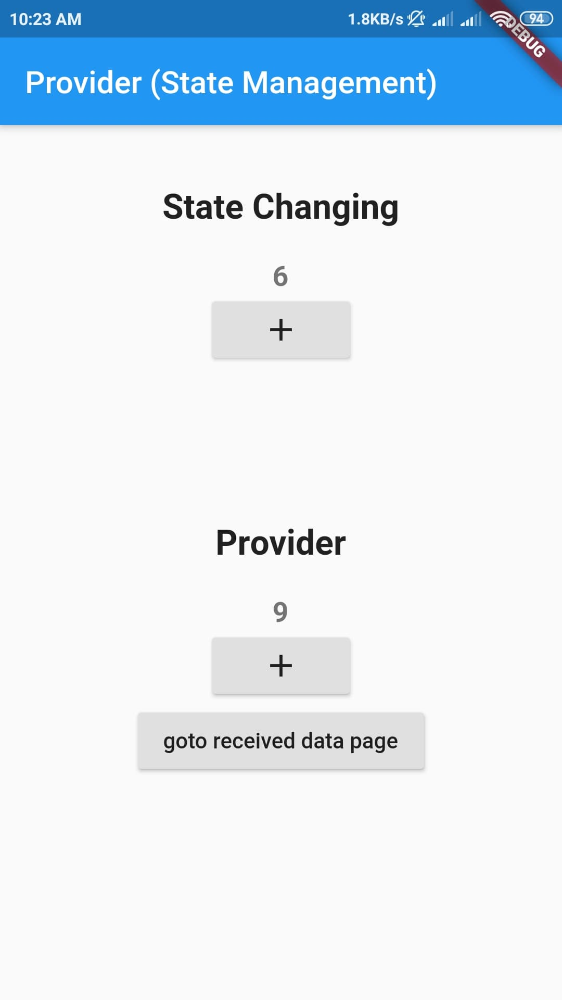

# Provider Basic

This project is for learning how to use provider in Flutter for state management.

### SingleProvider

```dart
ChangeNotifierProvider(
      create: (context) => Data(),
      child: MyApp(),
    ),
```

### MultiProvider

When injecting many values in big applications, `Provider` can rapidly become
pretty nested:

```dart
MultiProvider(
      providers: [
        ChangeNotifierProvider<ProviderClass>.value(value: ProviderClass())
      ],
      child: MyApp(),
    )
```

### In Provider Class

```dart
class Data extends ChangeNotifier {

  ProviderValueIncrement() {
   
    notifyListeners();
  }
}
```
 
## Screenshots
 &nbsp;&nbsp;&nbsp;&nbsp;&nbsp;&nbsp;&nbsp;&nbsp;&nbsp;&nbsp; 
